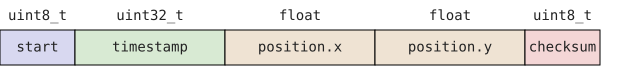
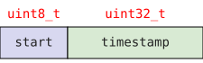
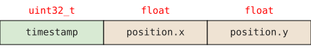

# Ultrasound-Based Indoors Real-Time Location System
This repository contains all the necessary code for the implementation of a prototype 2D Real-Time Location System (RTLS) with time-position history storage on a cloud database and a web interface for playback.

---

## Prerequisites
This prototype consists of four different components:
- a position tracker: running on a Teensy 4.0
- a history logger: running on an ESP32
- an MQTT and InfluxDB server
- an HTML/JS interface (`dashboard.html`)

Moreover, the position tracker expects at least 3 ultrasound ranging modules, communicating over UART, to function.

---

## Running
To build, upload and monitor the tracker component:
```
pio run -t upload -t monitor -e tracker
```

To build, upload and monitor the logger component:
```
pio run -t upload -t monitor -e logger
```

To setup the MQTT-InfluxDB data pipeline, make sure you have Mosquitto, InfluxDB2 and Telegraf installed on your system. Then, copy `server/mosquitto.conf` into `/etc/mosquitto/conf.d/rtls.conf` (or whatever you wish to name it), and `server/telegraf.conf` into `/etc/telegraf/telegraf.d/rtls.conf` (or whatever you wish to name it). Once that's done, simply run the bridge script:
```
python3 server/bridge.py
```
That will serve as the translation unit between the ESP32's struct-packed dumps and telegraf.

To run the dashboard, simply open a python server:
```
python3 -m http.server 8080
```
and open `localhost:8080`.

---

## Description: Hardware and Firmware
### Position Tracker
This component, running on a [Teensy 4.0](https://www.pjrc.com/store/teensy40.html), is tasked with collecting distance information from 3 or 4 ultrasound ranging modules (depending on your configuration). The main reason for this choice of board is its 7 hardware UART interfaces, sufficient to drive our ranging modules.

#### Ultrasound Ranging Module
We make use of 3 [AJ-SR04M modules](https://www.fabian.com.mt/viewer/42585/pdf.pdf), along with 1 module named SR04M-2 of unknown origin; though online reviews indicate it's functionally identical to the [JSN SR04T 2.0](https://github.com/HamidSaffari/JSN-SR04T/blob/master/JSN-SR04T-2.0.pdf).

We the AJ-SR04M modules in mode 4: low power UART (9600 baud rate). The module sits idle, until it receives a trigger byte `0x01`, upon which it initiates its ranging function, and reports back its measurement in a 4-bytes binary format: `0xFF, high_byte, low_byte, checksum`. The checksum is computed as the sum of `high_byte` and `low_byte` with no carry. The AJ-SR04M is reported in the datasheet to be able to achieve ranging upto 8m, however testing in real life revealed the true distance of detection highly depends on the size of the object. In our case, it ended up only detecting our object upto 4m away from its probe.

The SR04M-2 module is similar to the AJ-SR04M module. Though it is called mode 3, it also presents a low power UART mode, also with a 9600 baud rate. The only differences are that its trigger byte is `0x55`, and the checksum is computed as the sum of high and low bytes, as well as the start byte `0xFF`; yet again with no carry. This is equivalent to `high_byte + low_byte - 1`. Moreover, its (or rather, the JSN SR04T 2.0's) documented maximum range is 6m, as opposed to 8m for the AJ-SR04M. Again, in practice, this highly depends on the dimensions of the target. For ours, we were only able to reliably do range detection upto 2.5m away from the probe.

One thing to note is that the AJ-SR04M modules do not seem to exclusively accept `0x01` trigger bytes; for example, a `0x55` trigger byte will function all the same. It seems that they only check for the LSB being set, rather than the value of the entire byte being 1.

#### Module Calibration
Upon testing, it seems as if each sensor has an innate error term that is linear in distance. We took 5 to 8 measurements at known positions, 0.5m apart each, for each module. After coming to a convention on the module labeling, we approximated the following linear bias models:

```
measured[0] = 0.9896 * dist - 21.5
measured[1] = 0.9876 * dist - 12.6
measured[2] = 0.9713 * dist - 19.9
measured[3] = 1.0700 * dist - 43.9     // SR04M-2
```

As a result, we made sure to correct the bias for each reading in our implementation in accordance with this model.

#### Positioning Algorithms
We implement five positioning algorithms: trilateration, Ordinary Least Squares (OLS), Feasible Generalized Least Squares (FGLS), and Maximum Likelihood Estimation (MLE) with 4 anchors, and MLE with 3 anchors. Below are the execution time benchmarks for each, taken over 300 iterations on the Teensy 4.0, excluding a first discarded iteration.

|             Algorithm             | Min Cycle Count | Max Cycle Count |
| :-------------------------------: | :-------------: | :-------------: |
|           Trilateration           |   34 (56.7 ns)  |   35 (58.3 ns)  |
|                OLS                |   270 (450 ns)  |   270 (450 ns)  |
|               FGLS                |  1074 (1.79 us) |  1102 (1.84 us) |
| MLE-4 (4 Gauss-Newton iterations) |  3974 (6.6 us)  |  4061 (6.8 us)  |
| MLE-3 (8 Guass-Newton iterations) |   6616 (11 us)  |  6795 (11.3 us) |

Likewise, below are the error benchmarks, taken over 500 iterations, for simulated additive white noise-d input distance measurements with a standard deviation of 5 mm, in terms of distance between the true position and the estimated one:

|             Algorithm             | Mean Error (mm) | Standard Deviation (mm) |
| :-------------------------------: | :-------------: | :---------------------: |
|           Trilateration           |       3.47      |          0.02           |
|                OLS                |       2.68      |          2.32           |
|               FGLS                |       2.40      |          1.88           |
| MLE-4 (4 Gauss-Newton iterations) |       4.17      |          2.28           |
| MLE-3 (8 Guass-Newton iterations) |       2.86      |          2.57           |

#### Configuration
We attempted to write our firmware to be as library-like as possible. As a result, we want the distance reading module to be written in a manner agnostic to: which of the sensors are AJ-SR04M and which are SR04M-2, which UART interface is used by which sensor and what calibration method is suited for each sensor. Likewise, the positioning module should be agnostic to the physical sensor positions.

However, if these variables were to simply be passed to the modules as parameters at runtime, we would lose out on some optimization opportunities. Namely, we make the assumption that all of these previously mentioned variables are fixed throughout the program's operation. Hence, we made it so all of these configuration variables are to all be defined within one single `teensy/config.h` file. In the case of a missing variable definition, the compiler will throw an error during the preprocessing stage. All of the modules subsequently include this configuration file, allowing notably for many `constexpr` optimizations in the positioning module.

### Inter-Board Communication
The Teensy 4.0 makes no persistent storage of the time-position history within our architecture. Rather, as soon as the current position is estimated, it is immediately communicated to the ESP32 board, which then handles all the persistent storage. This happens over a UART link (9600 baud rate), following a simple protocol we designed.

#### Log Packet
The Teensy sends the data packed into the following 14 byte format:



We define the `start` byte to be of value `0xAA`. The `timestamp` is not a regular UNIX timestamp, rather it uses a custom time unit, depending on the rate of position sampling (e.g., 2 times per second => unit 0.5s), and a custom reference time 0 (e.g. 00:00:00.0 AM, Jan 1st 2020). Finally, the `checksum` is computed as the sum of `timestamp` and both `position.x` and `position.y` interpreted as arrays of `uint8_t`s, rather than IEEE floats.

#### Ack Packet
Upon receiving a log packet, the ESP32 is expected to send back an acknowledgement packet to successful proper reception. This is crucial for debugging the integrity of the UART link. The ack packet is 5 bytes long, of the following format:



Again, we define `start` to have value `0xAA`. The `timestamp` then must match that of the log packet being acknowledged.

#### Configuration
The UART interface to be used for board-to-board communication is defined within the respective board's `config.h`.

### History Logger
We use an off-brand ESP32 board built around the ESP32 Wrover SoC. As such, it comes natively with Bluetooth and WiFi connectivity, the latter of which we need to make use of cloud databases.

#### Local Logging
The board is not guaranteed to be able to reach the cloud database at all times: its own internet connection could drop, or the server could have downtime. Hence, it must implement some kind of local persistent storage to not lose the data in case of failure to reach the database. We choose to have it simply save the time-position history to a local file: `/history.log`. We use a simple binary format:



This format is not only easily parsable on the ESP32, but also allows for easy timestamp-indexed lookups; as opposed to a CSV or JSON storage format, which would cause the time-position entries to vary in size, and hence hinder the possibility of any fast lookups.

The ESP32 does not save to local storage as soon as it received a log packet however. Instead, it has two internal buffers meant for receiving log packets over UART; as soon as one buffer is filled, the receiving FreeRTOS task switches to using the other, while a concurrent FreeRTOS task wakes up and flushes the filled buffer to the local file. For this, we use a simple `xTaskNotifyWait()` and `xTaskNotifyGive()` pattern for the "buffer is full" event.

The reason for such a buffered writing method is the relative expensiveness of file opening operations, as well as Flash memory operations in general.

#### Cloud Logging
Operations over the internet can have significant latency, and hence must be made conservatively. We define a task concurrent to the previous two, which runs once every `DB_FLUSH_PERIOD` seconds (defined in `esp32/config.h`). It attempts to synchronize the database with the local persistent storage using the following procedure:
1. it fetches the timestamp of the last entry in the database
2. it looks up the position of the corresponding entry within the local file
3. it commits the succeeding entries from the local file to the database in batches of 20 via the MQTT topic `rtls/position/raw`.

#### System Monitor
We also added a simple system monitoring task, executing once every 5 seconds, printing out:
- most stack space used by each task (`uxTaskGetStackHighWaterMark`) during the last 5 seconds
- WiFi status: connected or disconnected, IP address and RSSI.
- MQTT status: connected or disconnected, last database entry

### Server
The server runs a Mosquitto server as an MQTT broker (configuration: `server/mosquitto.conf`), an InfluxDB server, a Telegraf server agent (configuration: `server/telegraf.conf`), and a custom python translation script.
